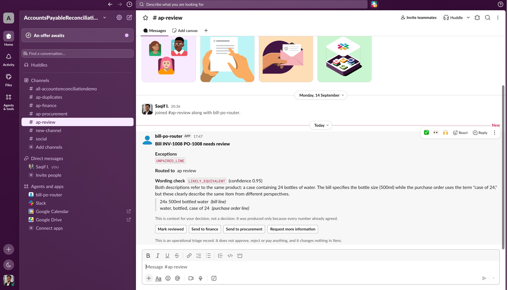
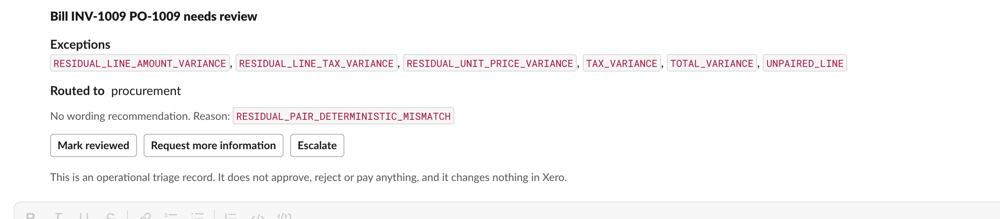
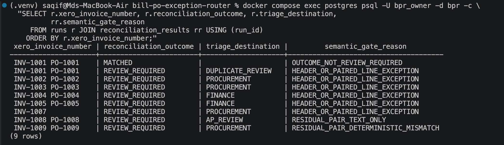
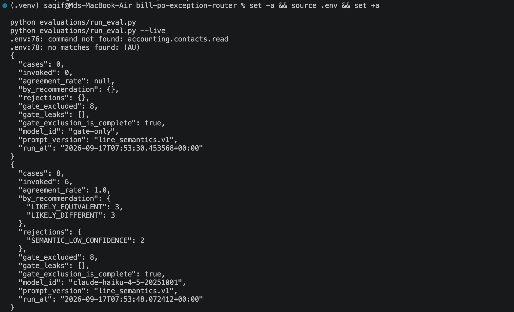

# Bill-to-purchase-order exception router

Deterministic rules detect financial exceptions in supplier bills. A language
model produces a bounded recommendation on genuinely ambiguous wording. A human
records the operational triage decision.

**Nothing in this system approves, rejects, pays or changes the status of a
bill.**

> **Status.** A portfolio build against a Xero demo company with synthetic data.
> It performs no writes to Xero. See
> [`docs/limitations-and-roadmap.md`](docs/limitations-and-roadmap.md).

## The problem

Supplier bills should match the purchase order they were raised against. Most
do, and confirming that is quick. The cost is the exceptions: working out which
kind of problem each one is, routing it to whoever can resolve it, and making
sure none is quietly forgotten.

This does the checking automatically, names the specific problem, routes it, and
records who decided what and what they were shown at the time.

## What it demonstrates

**A deliberate line between rules and AI.** Ten decisions are deterministic. One
is advisory. One belongs to a person. The model is asked a single question, about
one pair of strings, only after every number already agrees, and its answer
changes no outcome.

**A gate that is measured rather than asserted.** Thirteen conditions must hold
before a model is consulted, and the gate reason is recorded on **every** run,
including matched ones, so its behaviour is auditable rather than inferred from
the absence of a result.

**Failure modes that are designed, not discovered.** Six ways a model call can
fail, all landing in the same place: a human sees the case with no recommendation
at all rather than a hedged one.

**Guarantees the code can actually keep.** Slack delivery is at-least-once and
says so. A post that times out is recorded as `POSSIBLE_DUPLICATE`, because the
outcome is genuinely unknown.

**Invariants in the schema, not only in code.** A run cannot be observable with
an outcome set while still reconciling. The event log is append-only by trigger
and by privilege. Triage decisions are immutable.

### The same wording difference, two outcomes

A supplier billed for bottled water. The bill and the purchase order describe it
differently. On one, every number agrees; on the other, the unit price is five
dollars higher.





The model was consulted once and refused once, and the card says which happened
either way. The recommendation is labelled as context: it changed no outcome and
was not a routing input.

Note the second card carries six exception codes from one root cause. The unit
price differs, so the line amount differs, so the line tax differs, so both
totals differ. It routes to procurement rather than finance because routing
follows the **cause**, not the symptom: header aggregates like `TOTAL_VARIANCE`
are consulted only when nothing more specific is present.

## How it works

```
Xero bill -> deterministic reconciliation -> outcome
   MATCHED          recorded, closed, no human, no Slack
   UNPROCESSABLE    recorded with a reason
   REVIEW_REQUIRED  -> named exception codes -> a team that owns them
                    -> if, and only if, one line pair remains and every
                       number on it agrees: ask a model about the wording
                    -> Slack card -> a person decides -> recorded
```



## Running it

Requires Docker, Python 3.12+, and a Xero demo company.

```bash
cp .env.example .env        # fill every <<PLACEHOLDER>>
make lock                   # compile pinned, hashed lock files
make up                     # postgres, the service, n8n
make migrate
make gate                   # lint, tests, db boundary, secret scan
```

Tests run without any provider credential:

```bash
make test                   # live tests are excluded by default
pytest -m live              # only if you have configured Xero
```

## Results

Measured on nine seeded bills and a hand-labelled evaluation set. Reproduce with
`python scripts/capture_metrics.py` and `python evaluations/run_eval.py --live`.

**The invocation gate.** All eight cases in `account_code_gate_v1` were excluded
before any model call, on every run. That set exists to be excluded: a single
leak is a bug, not a tuning problem.

**Where the model was consulted.** Once, out of nine bills. The other eight
reached a human on deterministic exceptions alone.

**Agreement.** On `line_semantics_v1` the model answered six of eight cases and
agreed with the label every time. It declined the other two, which are the two
labelled `INSUFFICIENT_EVIDENCE`: "Consumables" against "Misc items", and "Item"
against "Goods". Neither is resolvable from the supplied text, and a system that
answered confidently there would be worse than one that declines.

**Model and prompt.** `claude-haiku-4-5-20251001`, prompt `line_semantics.v1`.
Both are recorded on every attempt, so a change in these numbers can be
attributed to a model change, a prompt change, or neither.



## Documentation

| Document | What it covers |
|---|---|
| [`BUILD-SCOPE-v1.md`](BUILD-SCOPE-v1.md) | What this version builds and what it defers |
| [`docs/ai-vs-deterministic-decisions.md`](docs/ai-vs-deterministic-decisions.md) | Where the model is used, and where it is not |
| [`docs/business-requirements.md`](docs/business-requirements.md) | The problem in the terms a business would use |
| [`docs/architecture.md`](docs/architecture.md) | What exists, in the order a bill passes through it |
| [`docs/invariant-register-v1.md`](docs/invariant-register-v1.md) | All 40 invariants and their status |
| [`docs/security.md`](docs/security.md) | Credentials, what leaves the machine, redaction |
| [`docs/responsible-ai.md`](docs/responsible-ai.md) | The commitments, and how they are enforced |
| [`docs/runbook.md`](docs/runbook.md) | Failures, each deliberately triggered |
| [`docs/limitations-and-roadmap.md`](docs/limitations-and-roadmap.md) | What this does not do, and why |
| [`docs/platform-mapping.md`](docs/platform-mapping.md) | What would change on SnapLogic or Tray |
| [`DECISIONS.md`](DECISIONS.md) | Eight decisions, with the alternatives rejected |

## What it deliberately does not do

No approval, rejection, payment or status change. No writes to any accounting
system. No goods-receipt matching, so the term three-way matching is not used.
No supplier communication. No production data.

Reasoning for each, and what it would take to change, is in
[`docs/limitations-and-roadmap.md`](docs/limitations-and-roadmap.md).